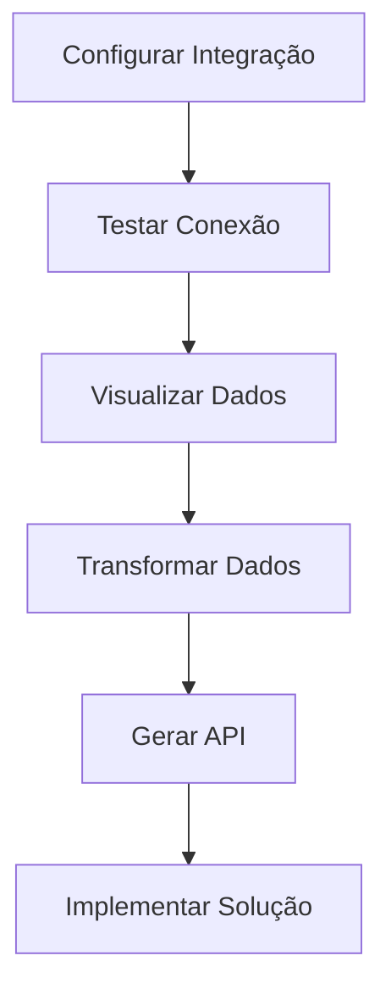

## 🙋‍♂️ Autor

<div align="center">
  
  <br>
  <strong>Onivaldo Miquelino</strong>
  <br>
  <a href="https://github.com/ninomiquelino">@ninomiquelino</a>
</div>

---

# 🧩 API Fusion Platform


**Sistema completo de integração low-code que demonstra na prática como conectar soluções visuais com APIs personalizadas para integração segura entre sistemas corporativos.**

## Visão Geral 

A **API Fusion Platform** é uma solução inovadora que combina conceitos low-code com desenvolvimento tradicional de APIs, permitindo que empresas integrem sistemas corporativos heterogêneos (CRM, ERP, RH) de forma segura, rápida e eficiente através de uma interface visual intuitiva.

### 🎯 Objetivos Principais

- **Democratizar integrações** através de abordagem low-code
- **Garantir segurança** em integrações entre sistemas corporativos
- **Reduzir tempo de desenvolvimento** de APIs personalizadas
- **Fornecer visibilidade completa** sobre fluxos de dados
- **Oferecer flexibilidade** para cenários complexos de integração

## Funcionalidades ✨ 

### 🎛️ Painel de Controle Unificado
- Dashboard visual com métricas de integração
- Visão consolidada de todas as conexões ativas
- Monitoramento em tempo real do status das APIs

### 🔌 Gerenciamento de Integrações
- **CRUD Completo** de configurações de API
- **Teste de Conexão** integrado para validação
- **Configuração Visual** de parâmetros e autenticação
- **Histórico** de execuções e logs

### 📊 Visualização de Dados Corporativos
- Dados simulados de **CRM** (leads, contatos, negócios)
- Informações de **ERP** (estoque, pedidos, inventário)
- Dados de **Recursos Humanos** (funcionários, departamentos)
- **Transformação visual** de dados entre formatos

### 🛠️ Construtor Low-Code de APIs
- **Geração automática** de código PHP para APIs
- **Suporte múltiplo** a tipos de endpoint (REST, GraphQL)
- **Configuração visual** de segurança (API Key, JWT, OAuth)
- **Download direto** do código gerado

### 🔒 Segurança Avançada
- **Gestão centralizada** de chaves API
- **Validação de endpoints** e certificados
- **Múltiplos níveis** de autenticação
- **Criptografia** de credenciais sensíveis

## Tecnologias 🛠️ 

### Backend
- **PHP 8.0+** - Lógica de servidor e APIs
- **MySQL 8.0** - Armazenamento de configurações
- **PDO** - Conexão segura com banco de dados
- **RESTful APIs** - Arquitetura de integração

### Frontend
- **JavaScript ES6+** - Interatividade e lógica cliente
- **CSS3** - Estilização moderna e responsiva
- **HTML5** - Estrutura semântica
- **Font Awesome** - Ícones e UI elements

### Segurança
- **CORS** - Controle de acesso entre origens
- **Validação de Input** - Prevenção de injection
- **Sanitização de Dados** - Limpeza de entradas
- **Headers de Segurança** - Proteções HTTP

## Arquitetura 🏗️ 

```

📦 API Fusion Platform
├──🔐 Backend (PHP)
│├── 📁 api/
││   ├── integration.php    # CRUD de integrações
││   ├── data.php          # Dados corporativos
││   └── auth.php          # Autenticação
│├── 📁 models/
││   └── IntegrationModel.php # Modelo de dados
│└── 📁 config/
│└── database.php      # Configuração DB
├──🎨 Frontend (JavaScript)
│├── 📁 js/
││   ├── api.js           # Cliente HTTP
││   ├── ui.js            # Gerenciador de interface
││   └── app.js           # Aplicação principal
│├── 📁 css/
││   └── style.css        # Estilos responsivos
│└── index.html           # Página principal
└──🗃️ Database
└── integrations         # Tabela de configurações

```

### Fluxo de Dados
1. **Configuração** → Interface low-code define integrações
2. **Persistência** → Configurações salvas no MySQL
3. **Execução** → APIs PHP processam requests
4. **Transformação** → Dados são convertidos e validados
5. **Retorno** → Respostas formatadas para frontend

## Instalação 🚀 

### Pré-requisitos
- Servidor web (Apache/Nginx)
- PHP 8.0 ou superior
- MySQL 8.0 ou superior
- Navegador moderno com JavaScript habilitado

### Passo a Passo

1. **Clone o repositório**
   ```bash
   git clone https://github.com/NinoMiquelino/low-code-integration-platform.git
   cd low-code-integration-platform
```

1. Configure o banco de dados
   ```sql
   CREATE DATABASE integration_system;
   USE integration_system;
   
   CREATE TABLE integrations (
       id INT AUTO_INCREMENT PRIMARY KEY,
       name VARCHAR(255) NOT NULL,
       api_endpoint VARCHAR(500) NOT NULL,
       api_key VARCHAR(500),
       config TEXT,
       created_at TIMESTAMP DEFAULT CURRENT_TIMESTAMP
   );
   ```
2. Ajuste as configurações
   Edite backend/config/database.php:
   ```php
   private $host = "localhost";
   private $db_name = "integration_system";
   private $username = "seu_usuario";
   private $password = "sua_senha";
   ```
3. Configure o servidor web
   · Coloque o projeto no diretório público do servidor<br>
   · Garanta permissões de escrita adequadas<br>
   · Habilite mod_rewrite se usando Apache
4. Acesse a aplicação
   ```
   http://localhost/low-code-integration-platform/frontend/
   ```

Uso 📖 {#uso}

🎯 Primeiros Passos

1. Acesse o Painel de Controle
   · Abra a aplicação no navegador<br>
   · Explore as três seções principais
2. Crie sua Primeira Integração
   · Navegue para "Gerenciar Integrações"<br>
   · Preencha nome, endpoint e chave API<br>
   · Configure parâmetros adicionais em JSON<br>
   · Clique em "Salvar Integração"
3. Teste a Conexão
   · Use o botão "Testar" na integração criada<br>
   · Verifique o status no sistema de notificações
4. Explore Dados Corporativos
   · Acesse "Visualizar Dados"<br>
   · Selecione entre CRM, ERP ou RH<br>
   · Analise as métricas e tabelas geradas
5. Gere uma API Personalizada
   · Vá para "Construtor de API"<br>
   · Defina nome, fontes de dados e segurança<br>
   · Gere e baixe o código PHP

📊 Fluxo de Trabalho Típico



## API Reference 🔗 

Endpoints Principais

GET /backend/api/integration.php

Descrição: Lista todas as integrações configuradas

Resposta:

```json
{
  "records": [
    {
      "id": 1,
      "name": "CRM Integration",
      "api_endpoint": "https://api.crm.com/v1",
      "api_key": "encrypted_key",
      "config": "{\"auth_type\": \"bearer\"}",
      "created_at": "2024-01-15 10:30:00"
    }
  ]
}
```

POST /backend/api/integration.php

Descrição: Cria uma nova integração

Body:

```json
{
  "name": "Nova Integração",
  "api_endpoint": "https://api.exemplo.com/v1",
  "api_key": "chave_api",
  "config": {"timeout": 30, "retries": 3}
}
```

GET /backend/api/data.php?source=crm

Descrição: Retorna dados simulados do sistema especificado

Parâmetros:

· source: crm, erp ou hr

## Exemplos 💡 

Caso de Uso 1: Integração CRM-ERP

Problema: Sincronizar automaticamente pedidos do CRM com o sistema de estoque do ERP.

Solução com API Fusion:

1. Configurar integração com API do CRM
2. Configurar integração com API do ERP
3. Criar API personalizada que:
   · Consulta novos pedidos no CRM<br>
   · Atualiza estoque no ERP<br>
   · Registra log da transação

Caso de Uso 2: Dashboard Unificado

Problema: Empresa precisa de visão consolidada de métricas de diferentes sistemas.

Solução:

1. Conectar APIs de CRM, ERP e RH
2. Criar endpoints unificados para:
   · Métricas de vendas (CRM)<br>
   · Indicadores de produção (ERP)<br>
   · Dados de pessoal (RH)
3. Desenvolver dashboard consumindo APIs geradas

📝 Exemplo de Código Gerado

```php
<?php
// API gerada automaticamente para integração CRM-ERP
header("Access-Control-Allow-Origin: *");
header("Content-Type: application/json; charset=UTF-8");

class GeneratedAPI {
    public function syncOrders() {
        // Lógica de sincronização gerada automaticamente
        $crmData = $this->getCRMData();
        $erpResponse = $this->updateERP($crmData);
        return ["success" => true, "synced" => count($crmData)];
    }
}
?>
```

## Segurança 🛡️ 

Medidas Implementadas

1. Validação de Input
   · Sanitização de todos os parâmetros<br>
   · Validação de formatos de URL e JSON<br>
   · Prevenção contra SQL injection com PDO
2. Autenticação e Autorização
   · Gestão segura de chaves API<br>
   · Suporte a múltiplos esquemas de autenticação<br>
   · Headers CORS configurados adequadamente
3. Proteção de Dados
   · Criptografia de credenciais sensíveis<br>
   · Logs sem exposição de informação crítica<br>
   · Headers de segurança HTTP
4. Boas Práticas
   · Prepared statements para queries SQL<br>
   · Validação de métodos HTTP<br>
   · Tratamento adequado de erros

🔐 Recomendações para Produção

· Use HTTPS em todos os endpoints<br>
· Implemente rate limiting<br>
· Adicione auditoria detalhada de logs<br>
· Configure monitoramento contínuo<br>
· Realize pentests regulares

📋 Padrões de Código

· Siga PSR-12 para PHP<br>
· Use ES6+ para JavaScript<br>
· Mantenha documentação atualizada<br>
· Adicione testes para novas funcionalidades

🙏 Agradecimentos

· Comunidade PHP e JavaScript<br>
· Contribuidores de código aberto<br>
· Equipes de teste e qualidade

---

<div align="center">

⭐️ Se este projeto te ajudou, considere dar uma estrela no repositório!

"Democratizando integrações corporativas através do low-code" 🚀

</div>
```

---

## Contribuições 🤝 
Contribuições são sempre bem-vindas!  
Sinta-se à vontade para abrir uma [*issue*](https://github.com/NinoMiquelino/low-code-integration-platform/issues) com sugestões ou enviar um [*pull request*](https://github.com/NinoMiquelino/low-code-integration-platform/pulls) com melhorias.

---

## 💬 Contato
📧 [Entre em contato pelo LinkedIn](https://www.linkedin.com/in/onivaldomiquelino/)  
💻 Desenvolvido por **Onivaldo Miquelino**

---
